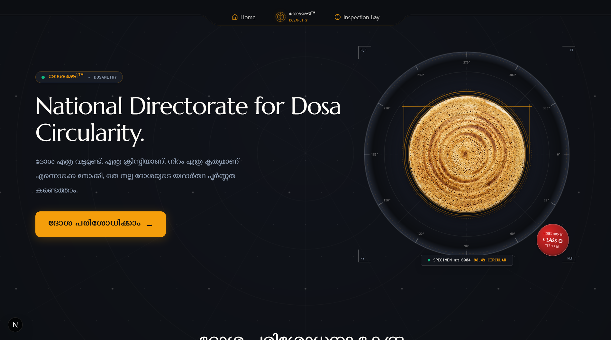
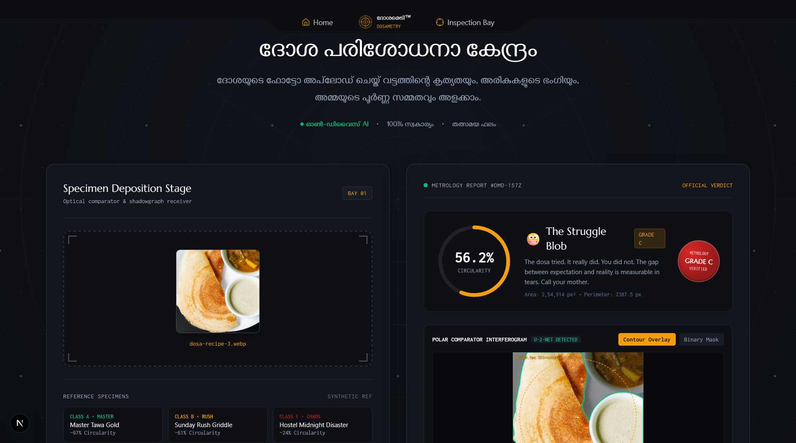
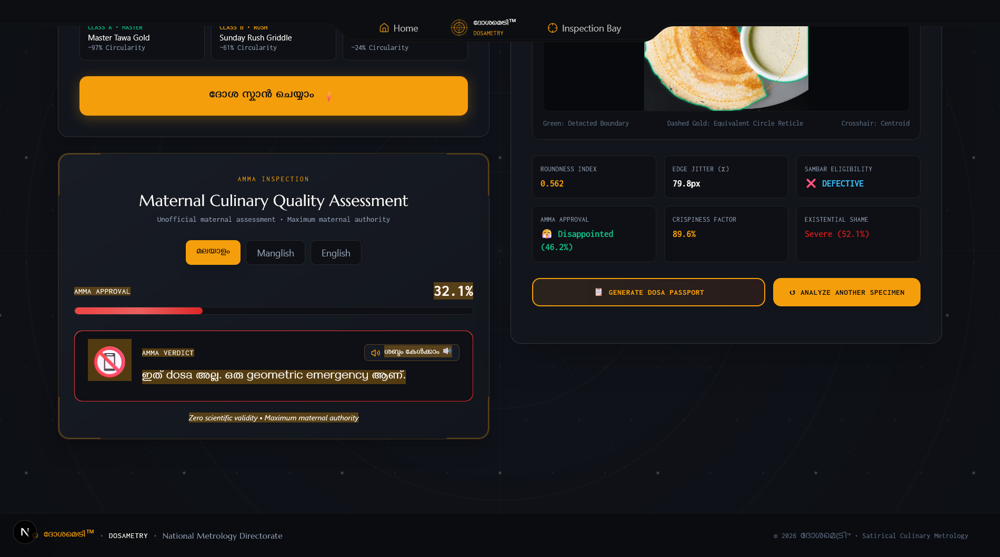
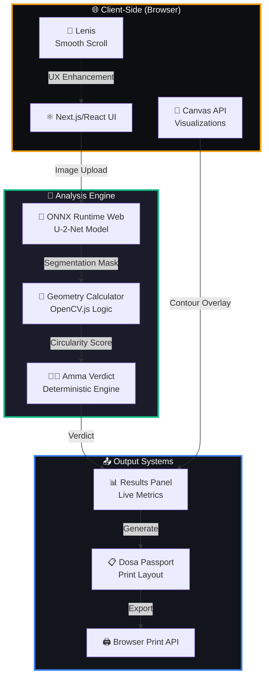

# Dosametry - Dosa Circularity Analyzer™ 🥞

## Basic Details

### Team Name: LOLGORITHMS

### Team Members

- Team Lead: [Nobin Sijo](https://www.linkedin.com/in/nobin-sijo-n77t/) - College of Engineering Karunagappally
- Member 2: [Pranav P](https://www.linkedin.com/in/pranav2109/) - College of Engineering Karunagappally

### Project Description

A satirical web application that uses real U-2-Net neural network segmentation and geometric analysis to scientifically determine how circular your dosa is. Upload a photo, get a circularity score (0-100%), and receive a comprehensive metrology report complete with Malayalam Amma Mode approval ratings and a printable Dosa Passport certificate!

### The Problem (that doesn't exist)

Have you ever wondered if your dosa is scientifically circular enough? Does it meet the rigorous standards of the National Metrology Directorate for Dosa Circularity? Will your Amma approve? These are the questions that keep us up at night. The world desperately needed a way to objectively measure dosa circularity using polar coordinate interferometry and matriarchal approval modeling.

### The Solution (that nobody asked for)

We built a full-stack Next.js application with real U-2-Net deep learning segmentation that analyzes your dosa's geometry with mathematical precision! Upload your dosa photo, and our system performs:
- Neural network boundary detection using U-2-Net ONNX model
- Real circularity calculation (C = 4πA/P²)
- Roundness index and edge jitter analysis
- Deterministic Malayalam Amma verdict engine
- Print-ready Dosa Passport with specimen ID

Because nothing says "I have my priorities straight" like using 170MB deep learning models to judge breakfast food!

## Technical Details

### Technologies/Components Used

For Software:

- **Languages**: TypeScript, JavaScript, CSS
- **Frameworks**: Next.js 16.3.5, React 19
- **Libraries**: 
  - ONNX Runtime Web (neural network inference)
  - Lenis (smooth scrolling)
  - Framer Motion (animations)
  - Lucide React (icons)
  - Tailwind CSS (styling)
  - Canvas API (visualizations)
- **Tools**: 
  - U-2-Net pre-trained model (salient object detection)
  - TypeScript compiler
  - ESLint
  - Git

### Implementation

For Software:

# Installation

```bash
# Clone the repository
git clone https://github.com/NobinSijo7T/Dosametry_useless_project.git
cd Dosametry_useless_project

# Install dependencies
npm install

# Download U-2-Net Model (170MB)
# Download from: https://drive.google.com/uc?export=download&id=1ao1ovG1Qtx4b7EoskHXmi2E9rp5CHLcZ
# Or use wget:
# wget --no-check-certificate 'https://drive.google.com/uc?export=download&id=1ao1ovG1Qtx4b7EoskHXmi2E9rp5CHLcZ' -O u2net.onnx

# Create directory and place model
mkdir -p public/U-2-Net/onnx
# Move downloaded model.onnx to: public/U-2-Net/onnx/model.onnx
```

# Run

```bash
# Development server
npm run dev

# Production build
npm run build
npm run start

# Open browser to http://localhost:3000
```

### Project Documentation

For Software:

# Screenshots (Add at least 3)


*Landing page with particle effects, Malayalam tagline, and CSS-animated dosa art showcasing the National Metrology Directorate branding*


*Real-time U-2-Net neural network processing with polar radar animation, telemetry logs, and progress indicators showing the specimen undergoing interferometry*


*Complete circularity report with animated score gauge, contour overlay visualization, 6 metrology metrics (Roundness, Jitter, Sambar Eligibility, Amma Approval, Crispiness, Existential Shame), Malayalam Amma Mode verdict selector, and print-ready Dosa Passport certificate*

# Diagrams

```mermaid
graph LR
    A[👤 User Upload<br/>Dosa Image] --> B[🧠 U-2-Net ONNX<br/>Inference]
    B --> C[📐 Contour<br/>Extraction]
    C --> D[🔢 Geometric Analysis<br/>Area, Perimeter, Centroid]
    D --> E[⭕ Circularity Formula<br/>C = 4πA/P²]
    E --> F[👩‍🍳 Amma Verdict<br/>Engine]
    F --> G[📋 Dosa Passport<br/>Generation]
    G --> H[🖨️ Print/Export<br/>Certificate]
    
    style A fill:#f59e0b,stroke:#d97706,stroke-width:2px,color:#0c0e12
    style B fill:#10b981,stroke:#059669,stroke-width:2px,color:#0c0e12
    style C fill:#3b82f6,stroke:#2563eb,stroke-width:2px,color:#fff
    style D fill:#8b5cf6,stroke:#7c3aed,stroke-width:2px,color:#fff
    style E fill:#ef4444,stroke:#dc2626,stroke-width:2px,color:#fff
    style F fill:#f59e0b,stroke:#d97706,stroke-width:2px,color:#0c0e12
    style G fill:#14b8a6,stroke:#0d9488,stroke-width:2px,color:#0c0e12
    style H fill:#6366f1,stroke:#4f46e5,stroke-width:2px,color:#fff
```



*Application workflow: Image upload → U-2-Net ONNX inference → Contour extraction → Geometric analysis (area, perimeter, centroid) → Circularity formula (4πA/P²) → Deterministic Amma verdict engine → Print-ready passport generation*

## System Architecture



*System architecture showing client-side processing flow, analysis engines, and output generation*

### Project Demo

# Video


https://github.com/user-attachments/assets/1f01091a-a0f5-4d2e-9177-c807112f52e0


> **Note:** If the video doesn't play above, [download it here](https://github.com/NobinSijo7T/Dosametry_useless_project/raw/main/assets/demo.mp4) or view it directly in the repository.

**Complete walkthrough demonstrating:**  
Hero section with particle canvas, dosa specimen upload, real-time U-2-Net segmentation with polar radar animation, results panel with 100% circularity score, contour overlay visualization, Malayalam Amma Mode language switcher (മലയാളം/Manglish/English), maternal verdict selection, and Dosa Passport certificate generation with print preview.

# Additional Demos

- Live U-2-Net neural network inference running in browser via ONNX Runtime Web
- Real geometric circularity calculation: C = 4πA/P² with actual contour coordinates
- Canvas-based contour overlay with detected boundaries, centroid, and equivalent circle
- Malayalam Unicode rendering in both UI and print output
- Lenis smooth scrolling with momentum physics
- Responsive design from mobile to 4K displays
- WCAG 2.1 Level AA accessibility compliance

## Team Contributions

- **Nobin Sijo**: Full-stack architecture, U-2-Net integration, geometric analysis algorithms, Malayalam Amma Mode engine, Dosa Passport print system, UI/UX design, deployment
- **Pranav P**: Project ideation, specimen testing, Malayalam verdict curation, demo video production, documentation, quality assurance

---

Made with ❤️ at TinkerHub Useless Projects 


